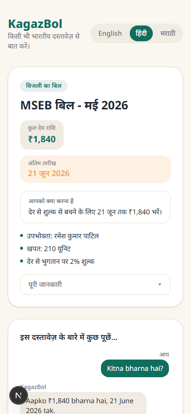
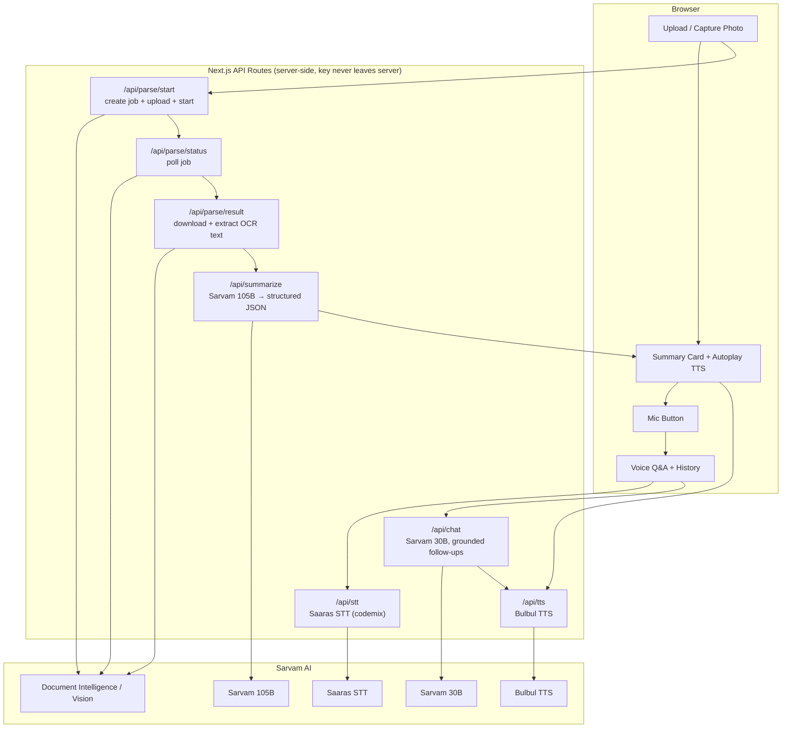

# KagazBol — Talk to any Indian document

> Photograph any Indian document — an electricity bill, a doctor's prescription, a bank notice,
> a government form — and have a natural voice conversation about it in Hindi, Marathi, or English.



## The problem

Hundreds of millions of Indians — parents, grandparents, first-generation digital users — regularly
receive documents they can't comfortably read: electricity bills full of English jargon, prescriptions
in cramped handwriting-turned-print, bank notices buried in officialese. Someone in the family usually
ends up reading it aloud and explaining it, often over the phone.

KagazBol turns that moment into a self-serve experience. Take a photo, hear a two-line summary in your
language, and ask follow-up questions out loud — "kitna bharna hai aur kab tak?" — and get an answer
spoken back, grounded only in *your* document.

This is deliberately impossible on an English-only AI stack. It needs Indic OCR that handles
Devanagari and code-mixed layouts, ASR that understands Hinglish/Marathi-English speech, an LLM that
reasons in Indian languages, and TTS that sounds natural in Hindi and Marathi — not robotic
transliteration. That's exactly what Sarvam AI's stack provides end-to-end.

## How it works

1. **Upload/capture** a photo of a document (or pick a bundled sample).
2. **Sarvam Document Intelligence (Vision)** OCRs the page — including Devanagari and mixed-script text.
3. **Sarvam 105B** turns the raw OCR text into a structured summary card: document type, key amounts,
   dates, deadline, and what action is required — in the user's chosen language.
4. **Sarvam Bulbul TTS** speaks a 2-line summary aloud immediately.
5. The user taps the mic and asks follow-up questions by voice. **Sarvam Saaras STT** transcribes
   (code-mixed Hindi/Marathi/English), **Sarvam 30B** answers — grounded strictly in the document — and
   **Bulbul TTS** speaks the reply. Conversation history is kept for the session.
6. A language switcher (English / हिंदी / मराठी) changes UI labels, summary language, and TTS voice.

## Architecture



## Which Sarvam model is used where, and why

| Capability | Model | Why |
| --- | --- | --- |
| Document OCR | **Sarvam Document Intelligence (Vision)** | Only model in the stack that reliably reads Devanagari + mixed-script Indian documents and preserves table/field structure. |
| One-shot document summary | **Sarvam 105B** | Accuracy-critical, called once per document — worth the extra latency to get amounts/dates/deadlines right and to write a fluent native-language summary. |
| Conversational follow-ups | **Sarvam 30B** | Latency-critical, called many times per session — a smaller model keeps the voice loop snappy without sacrificing grounded, in-language answers. |
| Voice replies | **Bulbul TTS** | Natural-sounding Hindi/Marathi/English voices, not robotic TTS. |
| Voice questions | **Saaras STT (codemix mode)** | Transcribes Hinglish/Marathi-English speech the way people actually talk, preserving English words in Latin script. |

Both chat calls log their latency to the server console (`[model-routing] ... Xms`). Note that
both `sarvam-105b` and `sarvam-30b` are *reasoning* models — they spend part of their token
budget on a hidden `reasoning_content` step before the final answer, so per-call latency varies
quite a bit (single-digit to tens of seconds). `chatCompletion` passes `reasoning_effort: "low"`
to keep that step short. The routing decision is driven less by a guaranteed per-call speed
delta and more by **call frequency and accuracy needs**: 105B runs once per document (worth
spending more tokens to get amounts/dates right), while 30B runs on every follow-up in a live
voice session (a smaller model with a tightly grounded prompt keeps the *typical* case snappy).

## Quickstart

```bash
git clone <this-repo>
cd kagazbol
cp .env.example .env   # then add your SARVAM_API_KEY
npm install
npm run dev
```

Open [http://localhost:3000](http://localhost:3000). Try a sample document or upload/photograph your own.

### Verify your API key works

Before relying on the app, run the smoke test against the live Sarvam API:

```bash
npm run smoke-test
```

This hits chat completions (105B + 30B), TTS, STT, and (if `public/samples/electricity-bill.png`
exists) the full Document Intelligence job flow, and prints status codes/latencies for each.

> **Note on `sarvam-105b`/`sarvam-30b`:** these are reasoning models that emit a hidden
> `reasoning_content` field before the final answer, and that hidden step varies a lot in
> length. The app sends `reasoning_effort: "low"` and a generous `max_tokens` (4096) to keep
> this reliable, but on rare occasions a smoke-test call may still come back with
> `finish_reason: "length"` and `content: null` — that's the live model, not a bug in this
> repo. The app's API routes handle this gracefully (the summary parser falls back to a
> partial summary, and `/api/chat` returns a clear error so the UI can prompt a retry).

## Project structure

```
src/
  app/
    page.tsx              # main UI: upload -> summary -> voice chat
    api/
      parse/start/        # create OCR job, upload image, start processing
      parse/status/       # poll job status
      parse/result/       # download + extract OCR text
      summarize/          # Sarvam 105B -> structured summary JSON
      chat/                # Sarvam 30B -> grounded follow-up answers
      tts/                 # Bulbul text-to-speech
      stt/                 # Saaras speech-to-text
  components/              # UploadCard, SummaryCard, ChatPanel, MicButton, ...
  hooks/                   # useAudioRecorder, useAudioPlayer
  lib/
    sarvam/                # typed Sarvam API clients (chat, tts, stt, doc intelligence)
    prompts.ts             # summary + grounded-chat system prompts
    i18n.ts                # UI strings for en-IN / hi-IN / mr-IN
public/samples/            # bundled fictional sample documents
scripts/
  smoke_test.ts            # live API smoke test (Phase 1 verification)
  generate-samples.ts       # regenerates the sample document images
docs/
  demo-script.md
  blog-draft.md
  submission-checklist.md
```

## Deploying to Vercel

- Set `SARVAM_API_KEY` as an environment variable in your Vercel project.
- Document Intelligence is an **async, polled job** (typically 15-60s). The browser polls
  `/api/parse/status` directly, so no single serverless function call needs to stay open that long —
  but make sure your plan's per-invocation timeout covers a single OCR/summarize call comfortably
  (Vercel Hobby's 10s default can be tight for the 105B summary call; Pro's 60s is safe).
- TTS responses are returned as base64 data URLs. Bulbul caps input at 2,500 characters, well within
  what spoken-style replies need, so payload sizes stay small.
- No database, auth, or persistent storage — each browser session holds its own document and
  conversation state in memory.

## What you could build on top

- **WhatsApp bot version** — same pipeline behind the WhatsApp Business API, so users never need to
  open an app.
- **Pension/scheme form filler** — extend the summary step to detect required fields and help users
  fill out government forms by voice.
- **Pharmacy prescription checker** — cross-reference extracted medicine names with a drug database
  and flag interactions or generic alternatives.
- **Village kiosk mode** — a shared-device mode with larger touch targets and a "read it again" button
  for low-literacy users.
